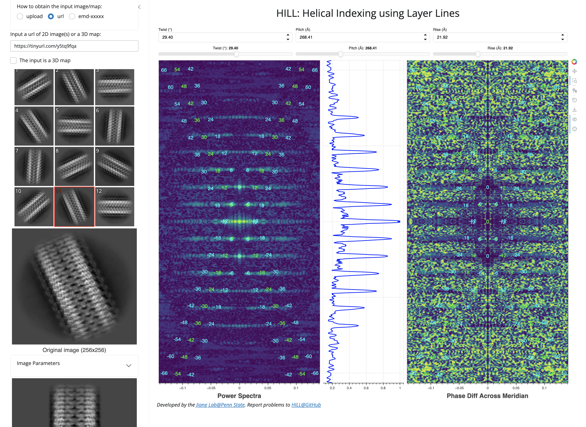

# HILL: <em>H</em>elical <em>I</em>ndexing using <em>L</em>ayer <em>L</em>ines
**HILL** is a Web app that allows the user to interactively index the parameters (pitch/twist, rise, csym) of a helical structure. It matches the layer lines expected for the candidate parameters (pitch/twist, rise, csym) to the layer lines in the power spectra of a projection image of the helical structure. 

No software installation is needed. Just [click me](https://019356a0-1149-a608-2a1f-5e0ddf6a980e.share.connect.posit.cloud) to index your helical structure!</a>

